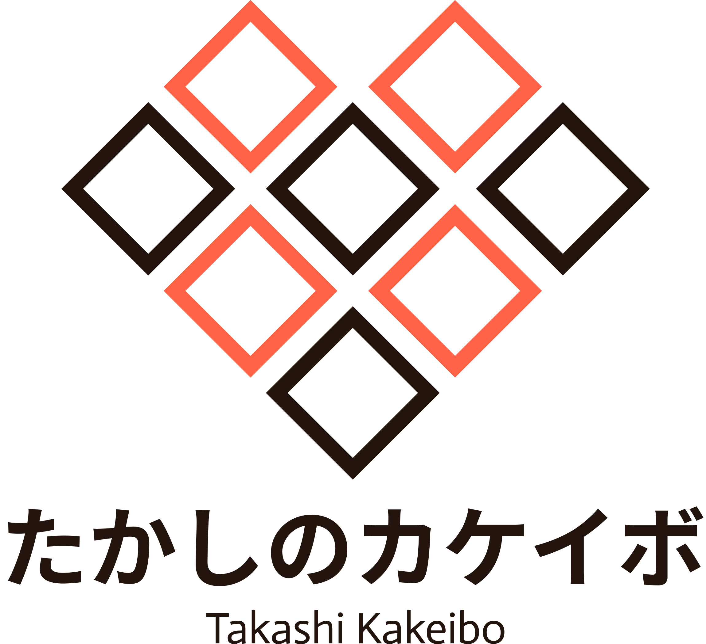

**Easily & Simply & Immediately**

### 開発環境

```bash
$ yarn install
# 実行後、Firebaseの認証情報を追記する
$ cp .env.local.example .env.local
$ yarn dev
```

### 本番環境

- Basic認証
  - ID: `uyupun`
  - パスワード: `takashiasuka`

```bash
# 実行後、Firebaseの認証情報を追記する
$ cp .env.local.example .env.local
# 実行後、Basic認証の認証情報を追記する
$ cp .env.production.local.example .env.production.local
# サーバの起動
$ make up
# サーバの終了
$ make down
# プロセスの確認
$ make ps
```

### 使用技術


### リンク

- [Figma](https://www.figma.com/file/kOALoH5sNvMtIAhQvHTTyb/takakeibo)
